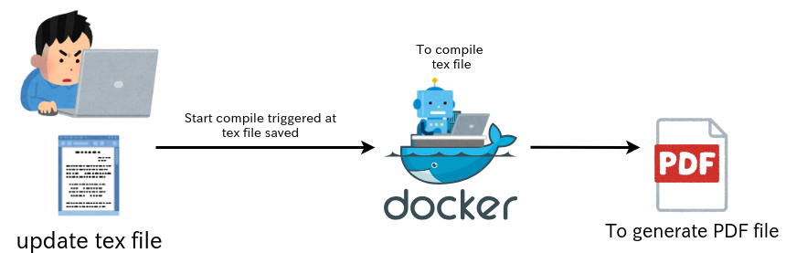

# UoA_GT_Docker

# 概要
会津大学の卒論を書く際のTexテンプレート&dockerで動く自動コンパイル環境です。

卒論用の`.tex`ファイルを更新するだけで自動でコンパイルがなされ、PDFまで生成されるようになります。



# 使用方法

## 使用ツール
- docker
- docker-compose
- direnv
- git

### direnvのインストール
direnvは、ディレクトリごとに環境変数を定義し、そのディレクトリがカレントディレクトリになったときにだけ環境変数を 有効/無効 にしてくれるツール。

今回はdocker-composeで起動時に使用する環境変数を設定したいために使用する。

#### インストール
インストールはcurlでバイナリをダウンロードすることでできる。以下のコマンドをターミナルで実行すると、スクリプトが自動でバイナリをダウンロードしてくる。

```
$ curl -sfL https://direnv.net/install.sh | bash
```

上手くインストールされれば出力として以下のようなものが出力される
```
The direnv binary is now available in:
    /path/to/install/directory
```

インストールされたディレクトリに移動し、direnvに実行権限を与える。

```
$ cd /path/to/install/directory
$ chmod +x direnv
```

また、インストールされたディレクトリにPATHが通っていなければ、PATHを通す。

```
$ echo PATH=$PATH:/path/to/install/directory >> ~/.bashrc
$ source ~/.bashrc
```

direnvの有効化をする。お使いの shell の rc ファイルに以下を追記

```
# bashの例
eval "$(direnv hook bash)"
```

これでdirenvのインストールは終了、次のステップに進む。

### docker, docker-composeのインストール
- docker
    
    [公式ドキュメント](http://docs.docker.jp/engine/installation/toc.html)から、ご使用の環境に合わせ、インストールしてください。

- docker-compose

    [公式ドキュメント](http://docs.docker.jp/compose/install.html)から、ご使用の環境に合わせ、インストールしてください。

### U-AizuGT.clsをコピー
卒論用のU-AizuGT.clsは大学のワークステーションに存在する。そのため、clsファイルをscpなどで取得してくる必要がある。

```
$ scp Your_Student_ID@sshgate.u-aizu.ac.jp:/usr/local/texlive-2018/texmf-local/tex/aizu/U-AizuGT.cls .
```

`@`の前に学籍番号を入れるのを忘れないでください。また、U-AizuGT.clsは卒論用のtexファイルが置かれている場所と同じディレクトリに置く必要があります。

# 自動コンパイル環境のインストール
以下の6ステップで卒論を書き始めることができる

1. zip Download または git cloneをする
2. 展開したフォルダ、またはcloneしてきたフォルダの中に入る
3. `.envrc.sample`を参考に、`.envrc`ファイルを編集する
4. direnvで環境変数を設定
5. `U-AizuGT.cls`を指定したディレクトリに配置
6. `docker-compose up`で起動

1, 2は省略し、3から解説をします。

### 4. `.envrc.sample`を参考に`.envrc`を設定する
`docker`ディレクトリ以下に`.envrc.sample`というファイルがあります。

```.envrc.sample
# user id and group id
export UID=$(id -u)
export GID=$(id -g)

# latex file and mount path
export MNTDIR=/path/to/.texfile/exsisting/dir
export SRCFILE=filename_for_Graduation_thesis.tex
```

これを参考に、`.envrc`というファイルを編集し環境変数を設定していきます。ここで設定された環境変数は`docker`ディレクトリでのみ有効化され、docker-composeで使用されます。

**.envrcはbashの記法のみが使用できます。お使いのシェルがzshやfishなどの場合でも.envrcはbash記法にのっとり作成しなければなりません。**

- UID GIDについて

    UID, GIDは基本的には変更しなくて構いません、この設定は生成されたPDFファイルの所有権をユーザーにするための設定なため、変更した場合PDFファイルの所有権がrootユーザーになる可能性があります。
    特にユーザーなどの指定をしたくない場合は変更しないようにしてください。

- SRCFILE, MNTDIRについて

    MNTDIRは卒論を書いている作業用ディレクトリを指定します。このディレクトリがdocker上でマウントされ、コンパイル時に使用されます。画像ファイルや参考文献のbibファイルを置いておくディレクトリです。
    
    SRCFILEは卒論用のtexファイルの名前です。docker上でコンパイルする際のファイル名として設定されます。MNTDIRにある卒論用のtexファイルを指定してください

#### .envrcの例 (UoA_GT_Dockerレポジトリにあるthesis_templateをコンパイルする場合)
```
# user id and group id
export UID=$(id -u)
export GID=$(id -g)

# latex file and mount path
export MNTDIR=$PWD/../thesis_template
export SRCFILE=thesis_template.tex
```

bashの記法が使用できるので、`docker`ディレクトリから相対パスで`thesis_template`を指定し、`MNTDIR`に指定しています。

MNTDIRは任意のパスを指定できるので、自由に変更可能です。

### 5. U-AizuGT.clsを指定したディレクトリに配置
準備の際に大学からコピーしてきた `U-AizuGT.cls`を`MNTDIR`に配置します。これはtexファイルの雛形のようなものなので、これが置かれていなければエラーで落ちます。

### 6. docker-compose upで起動

docker-composeコマンドが入っていれば、`docker`ディレクトリ内で

```
$ docker-compose up
```

を実行すれば、自動でコンパイルが開始されます。

コンパイルがされるだけではなく、docker-composeで動いている間はファイルの差分を監視し、texファイルに追記され、保存がされると自動で再コンパイルされます。

### 終了方法
docker-composeで立ち上がっている画面で `Ctrl + C` で終了することができます。


# 生成されたPDFファイル

https://github.com/hatobus/UoA_GT_Docker/blob/master/thesis_template/thesis_template.pdf

# 参考
- [v97ug/Aizu-Graduation-Thesis-Template](https://github.com/v97ug/Aizu-Graduation-Thesis-Template)
- [direnv repository](https://github.com/direnv/direnv)
- [日本語が扱える alpine の LaTeX イメージを作った話](https://3846masa.hatenablog.jp/entry/2017/02/08/215920)
- [dockerでvolumeをマウントしたときのファイルのowner問題](https://qiita.com/yohm/items/047b2e68d008ebb0f001)

# 最後に

このdocker imageを作成するに至るまでに生成されたPDFファイルの所有権がユーザーのものではなく、rootのものになるという大きな問題に直面していたが、私の信頼している高知県民[@katainaka0503](https://twitter.com/katainaka0503)にわかりやすい解説をしてもらい、助けてもらったことに大きな感謝の意を示し、このREADMEを終わる。

かたいなかさん、早く婚活を終わらせてください。